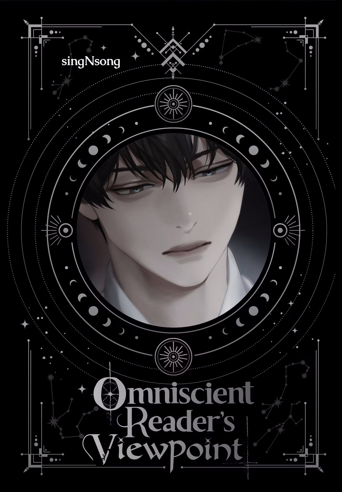
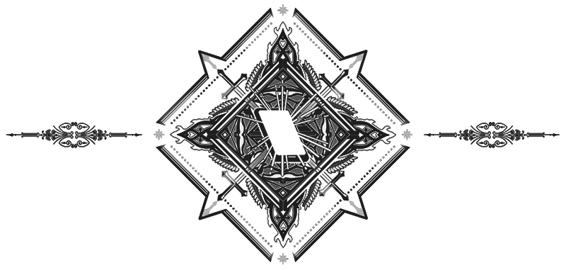

  

  # [ OMNISCIENT READER'S VIEWPOINT ]
  ### — Indonesian Fan-Translation —

  
  

  *"Kisah ini ditujukan bagi satu orang pembaca yang terus bertahan hingga akhir."*

---

## 📖 Tentang Proyek
Selamat datang di repositori proyek translasi **Omniscient Reader's Viewpoint (ORV)**. Proyek ini adalah sebuah **mini project** yang dikerjakan secara personal untuk menerjemahkan webnovel legendaris ini ke dalam Bahasa Indonesia dengan kualitas yang detail dan tetap mempertahankan nuansa aslinya.

Proyek ini menggunakan alur kerja modern berbasis Markdown untuk memastikan fleksibilitas dalam proses penerjemahan dan kemudahan dalam pembuatan file EPUB akhir.

## 🛠️ Tim & Kolaborasi
Proyek ini dikelola dengan bantuan AI untuk memastikan efisiensi dan konsistensi istilah:

- **Lead Translator**: **slvgnt—Taki**
- **AI Assistant**: **Antigravity** (Gemini AI Agent)

## 📁 Struktur Repositori
- `assets/` — Berisi gambar, sampul, dan aset visual lainnya.
- `content/` — Berkas utama translasi per-chapter dalam format Markdown.
- `src/` & `tools/` — Utilitas untuk otomatisasi pembangunan EPUB.
- `output/` — Hasil akhir translasi yang siap dibaca.

## 📜 Kredit & Disklaimer
- **Penulis**: Sing Shong (싱숑)
- **Ilustrasi**: Black Box (검넴)
- **Sumber Referensi**: Berdasarkan fan-translation komunitas internasional.

> [!IMPORTANT]
> Proyek ini murni bersifat **non-profit** oleh penggemar untuk penggemar. Hak cipta sepenuhnya milik penulis asli. Harap dukung penulis melalui platform resmi jika memungkinkan.

---

   
   
  
   
   
  <i>Dibuat dengan dedikasi untuk satu-satunya pembaca.</i>

