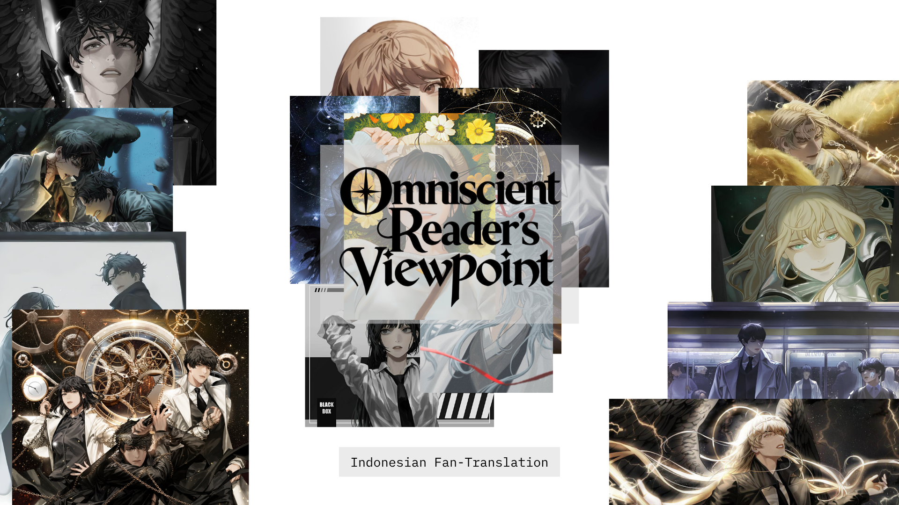
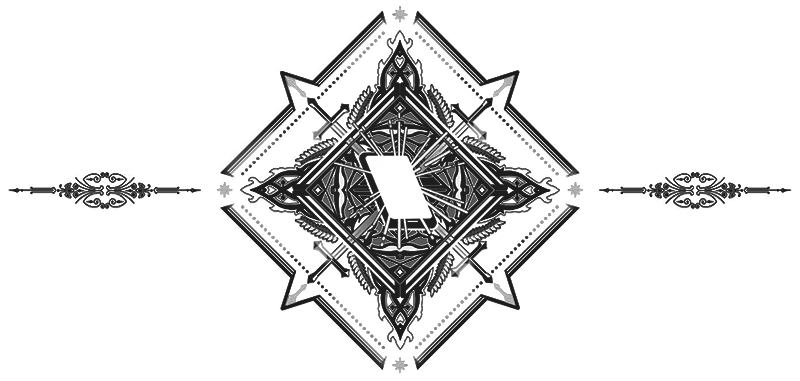

<div align="center">
  
  <br> <br>
  
  # [ OMNISCIENT READER'S VIEWPOINT ]
  ### — Indonesian Fan-Translation —

  [](#)
  [](#)

  *"Kisah ini ditujukan bagi satu orang pembaca yang terus bertahan hingga akhir."*
</div>

---

## 📖 Tentang Proyek
Selamat datang di repositori proyek translasi **Omniscient Reader's Viewpoint (ORV)**. Proyek ini adalah sebuah **mini project** yang dikerjakan secara personal untuk menerjemahkan webnovel legendaris ini ke dalam Bahasa Indonesia dengan kualitas yang detail dan tetap mempertahankan nuansa aslinya.

Proyek ini menggunakan alur kerja modern berbasis Markdown untuk memastikan fleksibilitas dalam proses penerjemahan dan kemudahan dalam pembuatan file EPUB akhir.

## 🛠️ Tim & Kolaborasi
Proyek ini dikelola dengan bantuan AI untuk memastikan efisiensi dan konsistensi istilah:

- **Lead Translator**: **slvgnt—Taki**
- **AI Assistant**: **Antigravity** (Agent Driven IDE)

## 📁 Struktur Repositori

```
orv-id-translation/
├── assets/                  # Gambar, sampul, dan aset visual
│   ├── cover.jpg
│   ├── cover-p1-v1.jpg
│   ├── stigma.png
│   └── style.css
├── content/                 # Draft translasi per-chapter (Markdown)
│   └── 00-intro.md
├── src/                     # Berkas EPUB siap-pakai
│   ├── META-INF/
│   │   └── container.xml
│   ├── OEBPS/
│   │   ├── images/
│   │   ├── intro.xhtml
│   │   ├── ch_1.xhtml ~ ch_551.xhtml
│   │   ├── afterword.xhtml
│   │   ├── content.opf
│   │   ├── toc.html
│   │   └── toc.ncx
│   ├── metadata.yaml
│   └── mimetype
├── tools/                   # Skrip bantu (Python)
│   ├── repack_epub.py
│   └── unzip_epub.py
├── build/                   # Output build sementara
├── output/                  # File EPUB final siap dibaca
└── README.md
```

## 📜 Kredit & Disklaimer
- **Penulis**: Sing Shong (싱숑)
- **Ilustrasi**: Black Box (검넴)
- **Sumber Terjemahan EN**: Komunitas penggemar internasional — [orv.pages.dev](https://orv.pages.dev)
- **Discord Komunitas EN**: [discord.gg/CZdNvKaNNr](https://discord.gg/CZdNvKaNNr)

> [!IMPORTANT]
> Proyek ini murni bersifat **non-profit** oleh penggemar untuk penggemar. Hak cipta sepenuhnya milik penulis asli. Harap dukung penulis melalui platform resmi jika memungkinkan.

## 🐛 Laporan Kesalahan
Menemukan typo, istilah yang kurang tepat, atau masalah lain? Silakan buat laporan di:

👉 [github.com/intxdv/orv-id-translation/issues](https://github.com/intxdv/orv-id-translation/issues)

---

<div align="center">
  
  <br> <br>
  <i>Dibuat dengan dedikasi untuk satu-satunya pembaca.</i>
  <br> <br>
<!--
  

-->
</div>
