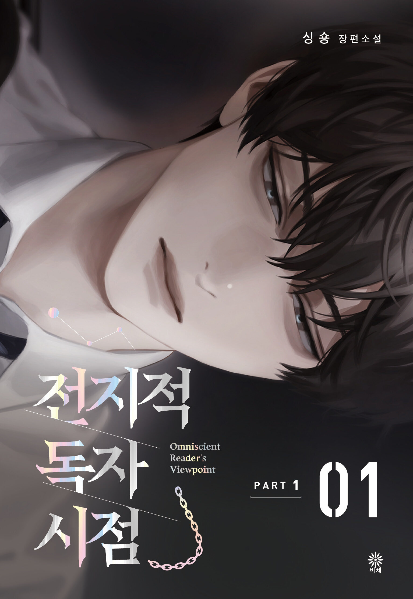

# Bab 1: Prolog - Tiga Cara untuk Bertahan Hidup dalam Dunia yang Hancur.

---

## Bab 1: Prolog - Tiga Cara untuk Bertahan Hidup dalam Dunia yang Hancur.

---

「Ada tiga cara untuk bertahan hidup dalam dunia yang hancur. Aku sudah melupakan beberapa di antaranya sekarang. Namun, satu hal yang pasti: kau yang sekarang sedang membaca kata-kata ini akan selamat.」

—Tiga Cara untuk Bertahan Hidup dalam Dunia yang Hancur [Selesai]

Sebuah platform web novel memenuhi layar ponsel pintar lamaku. Aku menggulir ke bawah lalu ke atas lagi. Sudah berapa kali aku melakukan ini?

"Sungguh? Ini akhirnya?"

Aku melihatnya sekali lagi, dan tanda 'selesai' itu tak salah lagi. Kisahnya telah berakhir.

> ### [Tiga Cara untuk Bertahan Hidup dalam Dunia yang Hancur]
> **Penulis**: tls123
> **3.149 bab.**

『Tiga Cara untuk Bertahan Hidup dalam Dunia yang Hancur』 adalah sebuah novel fantasi panjang dengan 3.149 bab. Nama singkatnya adalah 'Cara Bertahan Hidup'.

Aku telah membaca novel ini secara rutin sejak kelas tiga SMP. Bahkan saat aku dirundung oleh para berandalan di sekolah, bahkan saat aku harus masuk universitas lokal kelas tiga karena mengacaukan ujian masuk, bahkan ketika aku ditugaskan di unit militer garis depan karena undian wajib militer sial itu salah sasaran, dan bahkan sekarang, bekerja sebagai pegawai kontrak di sebuah anak perusahaan besar, masih tanpa pekerjaan tetap... Sialan, mari berhenti memikirkannya. Bagaimanapun juga.

「Kata-kata penulis: Terima kasih banyak telah membaca 'Cara Bertahan Hidup' sejauh ini. Aku akan kembali menemui kalian dengan sebuah [epilog]!」

"Ah… Masih ada epilognya. Berarti bab berikutnya benar-benar yang terakhir."

Berawal dari akhir masa kecilku hingga kini menginjak usia dewasa—sebuah perjalanan panjang yang membentang selama sepuluh tahun. Aku merasakan campuran antara perasaan hampa karena sebuah dunia akan segera berakhir, bersama dengan rasa puas karena akhirnya bisa mencapai kesimpulan dari dunia tersebut. Aku membuka kolom komentar bab terakhir dan menulis ulang sebuah kalimat beberapa kali.

—Kim Dokja: Penulis, terima kasih untuk segalanya selama ini. Aku menantikan epilognya.

Itu adalah kalimat yang tulus. Cara Bertahan Hidup adalah novel kehidupanku. Bukan yang paling populer, tapi itu adalah novel terbaik bagiku. Banyak kata yang ingin kusampaikan namun tak sanggup kutuliskan. Aku takut kata-kataku yang ceroboh akan melukai sang penulis.

—Rata-rata 1,9 hit per bab.
—Rata-rata 1,08 komentar.

Ini adalah indeks popularitas rata-rata dari 'Cara Bertahan Hidup'. Jumlah penayangan untuk bab pertama adalah 1.200, tapi turun menjadi 120 pada bab ke-10, lalu 12 pada bab ke-50. Di saat mencapai bab ke-100, jumlahnya hanya tinggal 1.

Hit = 1.

Aku merasa sesak oleh perasaan yang kudapat saat melihat angka '1' yang muncul di samping daftar bab tersebut. Dalam beberapa kasus, ada angka '2', tapi kemungkinan itu adalah seseorang yang salah menekan tombol.

*Terima kasih.*

Penulis tersebut telah menerbitkan sebuah novel dengan lebih dari 3.000 bab hanya dengan 1 hit per bab dalam kurun waktu 10 tahun. Benar-benar sebuah kisah yang hanya ditujukan untukku. Aku menekan 'Papan Rekomendasi' dan segera mulai mengetuk papan ketik.

—Aku punya novel keren untuk direkomendasikan.

Penulis telah menuliskan novel gratis yang sudah selesai untukku, jadi aku harus memberinya sebuah rekomendasi. Aku mengeklik tombol 'selesai', dan komentar-komentar dengan cepat bermunculan.

—Sepertinya seorang pembenci *anti* baru. Aku mencari ID orang ini, dan mereka merekomendasikan novel yang sama beberapa kali.
—Bukankah rekomendasinya dilarang? Penulis tidak seharusnya melakukan ini di sini.

Terlambat, aku menyadari bahwa aku sudah menulis rekomendasi beberapa bulan yang lalu. Dalam sekejap, puluhan komentar telah dipenuhi dengan retorika seperti "pencari perhatian" atau "bodoh." Wajahku memerah.

Aku yakin penulisnya juga akan membaca ini. Jadi, aku buru-buru mencoba menghapus unggahanku, tetapi aku hanya mendapat pesan yang menyatakan bahwa unggahan itu tidak bisa dihapus karena sudah dilaporkan.

"Ini…"

Muncul rasa getir di mulutku saat membayangkan rekomendasi yang kutulis dengan tulus malah berakhir menjadi noda pada reputasi novel tersebut. Seandainya mereka melirik sedikit saja, mengapa tidak ada yang mencoba untuk membaca novel menarik ini? Aku ingin memberikan donasi kepada penulisnya, tetapi aku tidak sanggup karena aku hanyalah seorang pekerja gaji yang nyaris tidak mampu menopang hidup. Kemudian, aku menerima notifikasi bahwa sebuah 'pesan telah tiba'.

—tls123: Terima kasih.

Sebuah pesan masuk tiba-tiba saja. Butuh waktu bagiku untuk memahami situasinya.

—Kim Dokja: Penulis?

tls123—itu adalah penulis 'Cara Bertahan Hidup'.

—tls123: Aku bisa menyelesaikannya sampai akhir berkat dirimu. Aku juga memenangkan sebuah kompetisi.

Aku tidak bisa mempercayainya. Cara Bertahan Hidup memenangkan sebuah kompetisi?

—Kim Dokja: Selamat! Kompetisi apa itu?

—tls123: Kau tidak akan mengetahuinya karena itu adalah kompetisi yang tidak populer.

Aku bertanya-tanya apakah dia berbohong karena merasa malu, tapi aku ingin itu benar. Mungkin saja aku memang tidak tahu. Bisa jadi itu menjadi hit besar di platform lain. Aku merasa sedikit sedih, tapi bagus jika sebuah kisah yang luar biasa tersebar luas.

—tls123: Aku ingin mengirimkan hadiah spesial untukmu sebagai ucapan terima kasih.

—Kim Dokja: Hadiah?

—tls123: Berkat pembacaku tersayanglah kisah ini bisa terlahir ke dunia.

Aku memberikan alamat emailku kepada penulis sesuai permintaannya.

—tls123: Ah, benar juga. Aku sudah mendapatkan jadwal monetisasi.

—Kim Dokja: Wah, benarkah? Kapan akan dimulai? Karya besar ini seharusnya sudah berbayar sejak awal...

Itu bohong. Cara Bertahan Hidup adalah seri harian, jadi aku harus menghabiskan 3.000 won sebulan. 3.000 won adalah harga satu makan siang di minimarket bagiku.

—tls123: Monetisasi akan dimulai besok.

—Kim Dokja: Kalau begitu epilog yang keluar besok akan berbayar?

—tls123: Ya, sayangnya kau harus membayar untuk itu.

—Kim Dokja: Tentu saja, aku pasti membayar! Aku akan membeli bab terakhirnya!

Setelah itu, tidak ada balasan dari penulis. Sepertinya mereka sudah keluar dari situs tersebut. Rasa hampa menyelimuti diriku. Apakah mereka pergi tanpa membalas sekarang karena sudah sukses? Kekagumanku berubah menjadi kecemburuan kecil. Memangnya apa yang membuatku begitu bersemangat? Bukan berarti aku yang menulis novelnya juga.

"Akankah mereka memberiku sertifikat hadiah? Akan menyenangkan jika isinya sekitar 50.000 won."

Itulah pikiran-pikiran naif yang kumiliki saat itu.

Aku tidak tahu apa pun tentang apa yang akan terjadi pada dunia keesokan harinya.

---
[[ KLIK UNTUK MEMBACA KOMENTAR BAB ]](https://orv.pages.dev/stories/orv/read/ch_1#comments)
---
